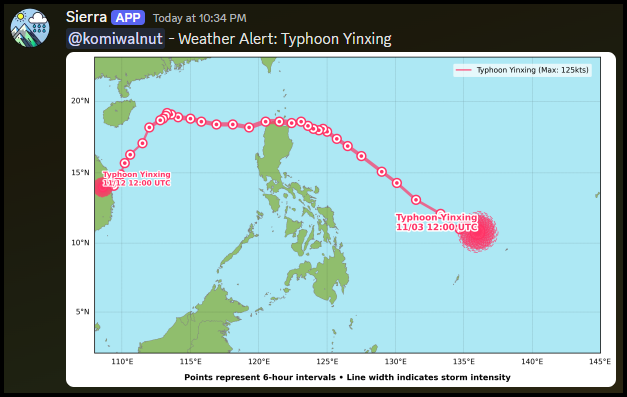

# Philippine Weather Update Bot


Do you want to add Sierra to your server? [Click here to invite the bot!](https://discord.com/oauth2/authorize?client_id=1310593510461935628)

**Sierra** is a discord bot that provides automated weather updates and storm tracking for the Philippines, utilizing NASA's EONET API for storm data.

## Features

- 🌪️ Real-time severe weather tracking
- 🗺️ Visual storm path mapping
- ⏰ Automated daily updates (8 AM Philippines Time)
- 📢 Dedicated read-only weather channel
- 🔄 Simple slash command interface

## Sample Images




## Prerequisites

- Python 3.8+
- pip
- PM2 (for production deployment)
- Discord Bot Token
- NASA API Key

## Installation

1. Clone the repository
```bash
git clone https://github.com/komiwalnut/Sierra.git
cd Sierra
```

2. Create and activate virtual environment
```bash
python -m venv sierra-venv
```
```bash
source sierra-venv/bin/activate
```

3. Install dependencies
```bash
pip install -r requirements.txt
```

4. Create an `.env` file and configure environment variables
```env
DISCORD_BOT_TOKEN=your_discord_bot_token
NASA_API_KEY=your_nasa_api_key
```

## Configuration

### Discord Bot Token
1. Go to [Discord Developer Portal](https://discord.com/developers/applications)
2. Create a new application
3. Navigate to the "Bot" section
4. Click "Reset Token" to get your bot token
5. Enable the following bot permissions:
   - Attach Files
   - Manage Channels
   - Send Messages
   - Use Slash Commands
   - View Channels
   - Read Message History

### NASA API Key
1. Visit [NASA API Portal](https://api.nasa.gov/)
2. Fill out the form to get your API key
3. Add the key to your `.env` file

## Development

Run the bot locally:
```bash
python main.py
```

## Production Deployment

This bot is configured to run with PM2 process manager. Create an `ecosystem.config.js` file:

```javascript
module.exports = {
  apps: [{
    name: 'Sierra',
    script: 'main.py',
    interpreter: 'python3',
    autorestart: true,
    watch: false,
    max_memory_restart: '1G',
    env: {
      NODE_ENV: 'production'
    }
  }]
};
```

Start the bot with PM2:
```bash
pm2 start ecosystem.config.js
```

Monitor the bot:
```bash
pm2 logs Sierra
```

## Usage

1. Invite the bot to your server using the OAuth2 URL from Discord Developer Portal
2. Use `/weather` command to get current weather updates
3. The bot will automatically create a read-only channel named `🇵🇭-weather`
4. Daily updates will be posted at 8 AM Philippines Time

## Project Structure
```
Sierra/
├── src/
│   ├── __init__.py
│   ├── bot.py            
│   ├── cache.py          
│   ├── config.py
│   ├── nasa_client.py    
│   ├── settings.py  
│   └── visualization.py         
├── main.py
├── requirements.txt
├── ecosystem.config.js
├── .env
├── .gitignore
└── README.md
```

## Contributing

1. Fork the repository
2. Create your feature branch (`git checkout -b feature/AmazingFeature`)
3. Commit your changes (`git commit -m 'Add some AmazingFeature'`)
4. Push to the branch (`git push origin feature/AmazingFeature`)
5. Open a Pull Request
